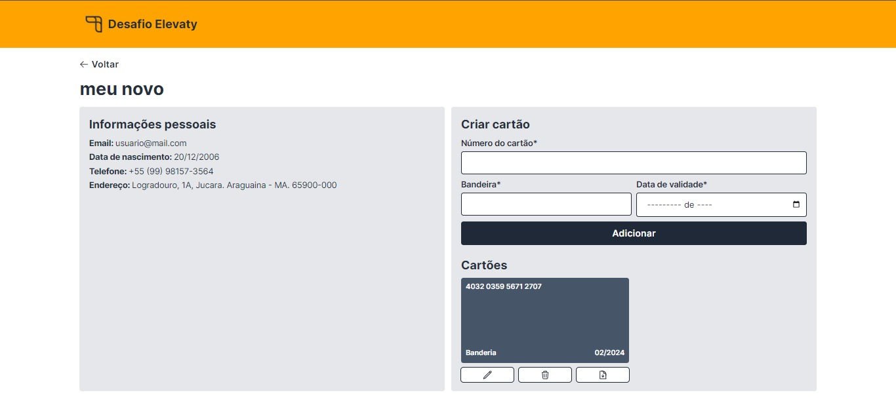

<br/>
<p align="center">
  <h3 align="center">Desafio Técnico - Elevaty</h3>

  <p align="center">
    Desafio técnico para a vaga de Desenvolvedor Full Stack na Elevaty.
    <br/>
    <br/>
  </p>
</p>

### Pré-requisitos

- npm
- nodeJS
- Docker
- Docker Compose

### Instalação

1. Clone o repositório

- com HTTP

```sh
git clone https://github.com/valderyjr/desafio-elevaty.git
```

- com SSH

```sh
git@github.com:valderyjr/desafio-elevaty.git
```

2. Instale as dependências do projeto

```sh
npm install
```

3. Copie o arquivo `.env.example` de `/frontend` e `/backend` para um `.env` em cada pasta.

```sh
 cp ./frontend/.env.example ./frontend/.env && cp ./backend/.env.example ./backend/.env
```

4. Execute o docker compose para criar o banco de dados

```sh
 docker compose up -d
```

5. Execute as migrations

```sh
cd ./backend/
npm run db:migrate
npm run db:generate
```

6. Rode o backend

```sh
npm run build && npm run start
```

7. Em outro terminal, rode o frontend

```sh
cd ./frontend/
npm run build && npm run start
```

### Informações sobre a API

- Em caso de erro de validação na criação do cartão de crédito, usar [este](https://developer.paypal.com/api/rest/sandbox/card-testing/#link-creditcardgenerator) site para gerar números válidos de cartão de crédito.
- [Como fazer requisições](./backend/README.md)

### Imagens




## Autor

- [Valdery Junior](https://github.com/valderyjr/)
